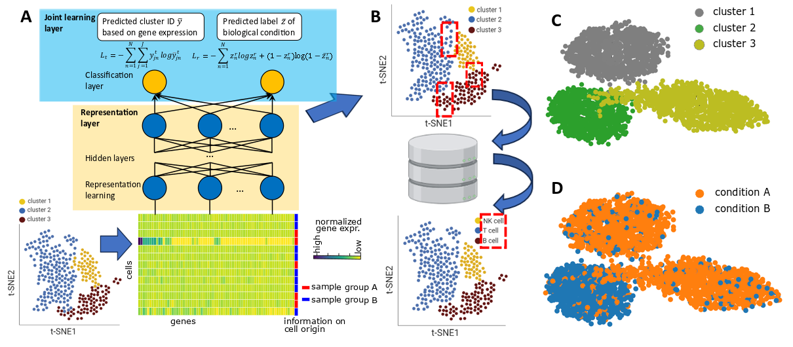

# scDeepJointClust

The proposed method proceeds in four steps. 
Firstly, a DNN model is constructed and trained (Fig.1A). 
Secondly, the representation data is retrieved from the trained DNN model and a clustering algorithm is performed on it (Fig.1B). 
After that, the clustering result is annotated using SingleR (16) (Fig. 1C). 
Lastly, the performance of the method is evaluated by considering the true positive rate and false positive rate (Fig. 1D).

